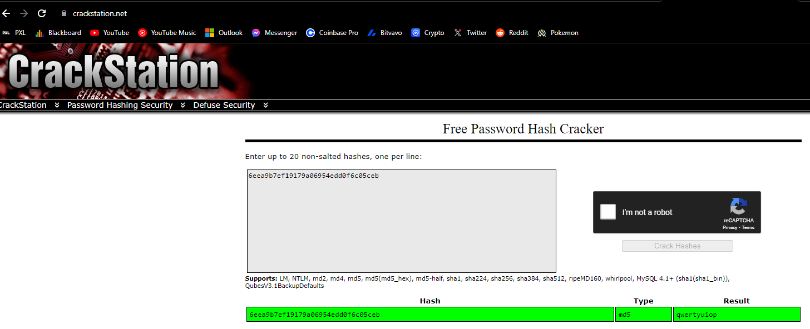

# OWASP Top 10 – 2021

## Broken Access Control
Broken access control allows attackers to bypass authorization, allowing them to view sensitive data or perform tasks they aren’t supposed to.

## IDOR
- First step is to log into the server. Username: `noot` and password: `test1234`.

- If we change the ID in the URL to 0, we get the flag.

## Cryptographic Failures
- If we check the login page of the website, we can find this:

- If we go to the `/assets` endpoint, we can download the `webapp.db` database and see the hash of the admin user.

- If we visit [crackstation.net](https://crackstation.net), we can decipher the hash to find the password of the admin user.

- Then, if we log in as the admin, we can find the flag.

## Injection
Since we are looking to find files in the root directory, the Linux command we use is '`ls`' and we can see that the shady file in question is actually drpepper.txt:

If we want to check 
